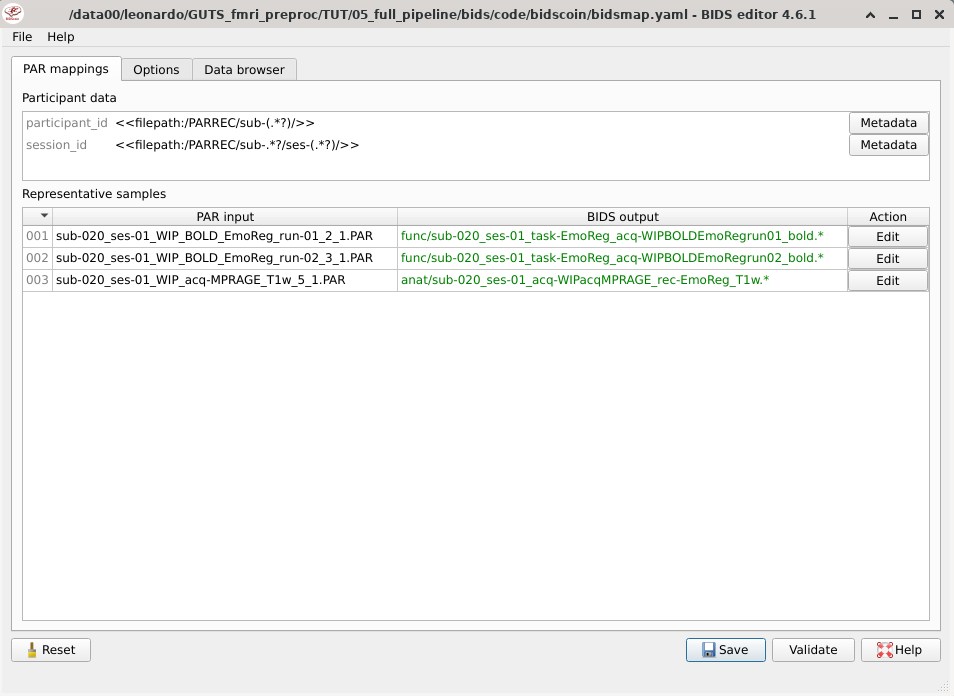
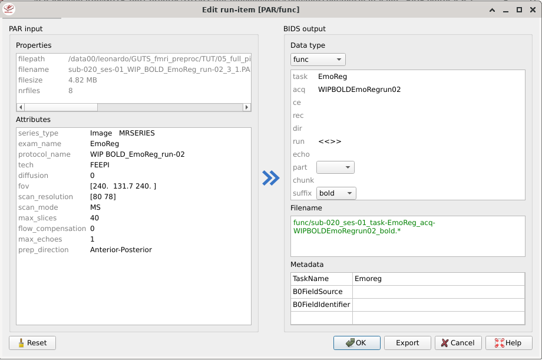
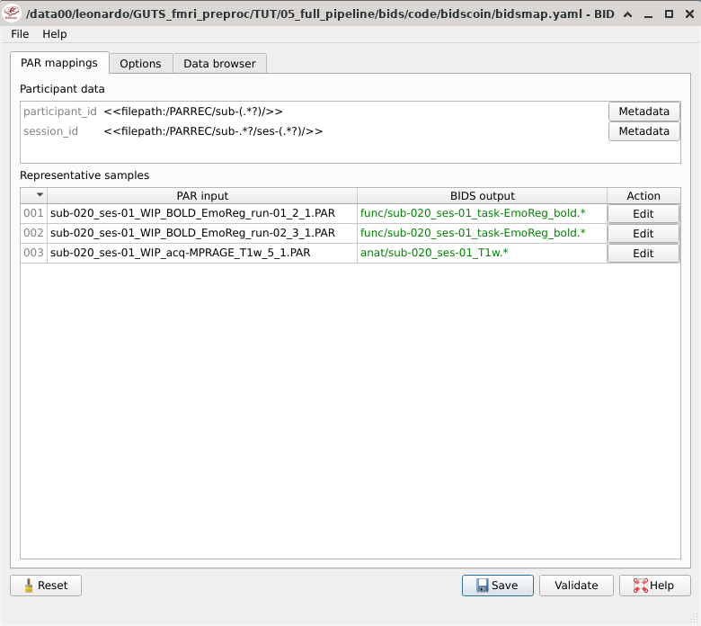
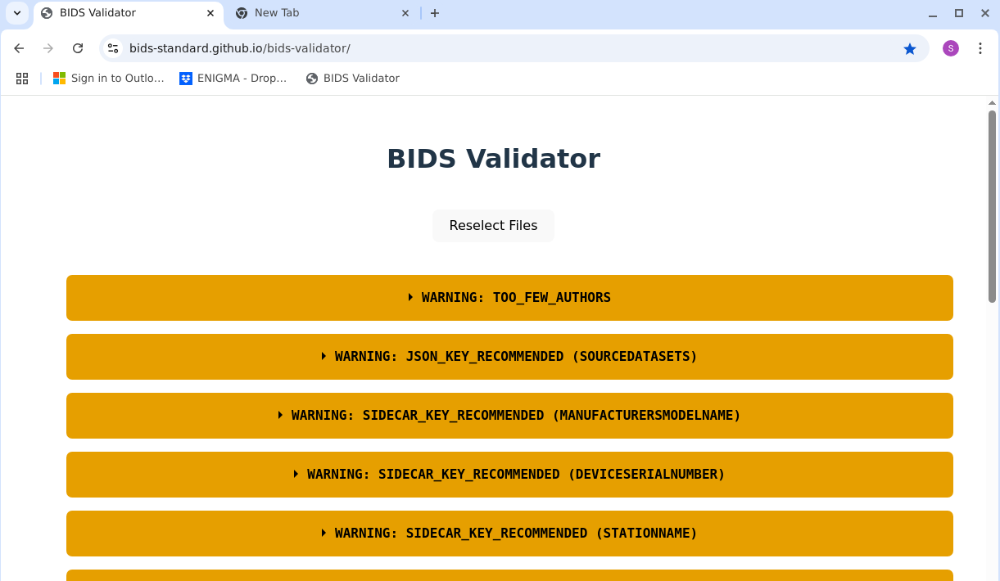

# Full preprocessing pipeline

LC apr 2025

**NB**: actually there is _not_ a full preproc pipeline in this md. That was the initial intention, but it's not a task that can be accomplished in a couple of days.

Instead here you can find:

- bidscoin
- trimming PAR file for aborted fmri acquisitions
- bids validation
- pydeface (short intro)
- running bidsapp
- fsl proposal

Right now (Nov 2025) I am instead working on a proposal for a actual full pipeline keeping in mind the students' need in the `proposal.md` (again, _cum grano salis_, it's a work in progress).


# Setting up the environment

## Create a python virtual environment (venv)
Some of the (pre)processing we will do involve using python libraries. It is a good practice to create a venv so that you can isolate the specific set of libraries (and their specific version) which is required for a given task. 

```bash
python -m venv venv_fmri_preproc
source venv_fmri_preproc/bin/activate
# then you can pip install what you need
```

When you are done with your task, you should freeze the set of libraries in the venv with `pip freeze > requirements.txt`. This ensures you can make your analysis reproducible the next time you will run it - possibily on another data - and for when you need to share your script/pipeline with someone else. 

Also I would advise to delete your `venv_<venv_name>` dir(ectory) once you are done processing. These venv can grow pretty big pretty fast.

If you need also a specific python version, consider using `pyenv` or `conda`.

## Make sure fsl is available
Simply run `which fsl` from the terminal and then `fsl` from an X terminal. If anything appears, it means you have fsl (it should already be on storm, although I use the copy I installed on another directory). In general, there should be the following lines in some file which is evaluated when the terminal opens, such as in `~/.bash_profile`:

```bash
# ----------- FSL 5 ------------
FSLDIR=<path/to/fsldir>
. ${FSLDIR}/etc/fslconf/fsl.sh
PATH=${FSLDIR}/bin:${PATH}
export FSLDIR PATH
```

## Make sure docker is available
And specifically that you are in the docker group.

```bash
getent group docker
```

If you are not in the group, you user can be (sudo) added with

```bash
sudo usermod -aG docker yourusername
```

## Viewing brain images
[Here](https://github.com/leonardocerliani/GUTS_fmri_preproc/tree/main/TUT/00_begin_here) there are some options, including instructions on how to install the ole-but-good [fslview in a box](https://github.com/leonardocerliani/GUTS_fmri_preproc/tree/main/TUT/00_begin_here#fslview-in-a-box-ie-docker) (some tweaking might be necessary).


# Bidscoin to convert PARREC to bids nifti compressed (nii.gz)
[bidscoin](https://bidscoin.readthedocs.io/en/latest/index.html) is a python software to generate bids-compliant nii starting from dcm and PAR/REC files. It is particularly interesting for us since this format is the most common in our lab (as we work on a Philips scanner).

Importantly, bids is not only about the naming convention for the images, but also about the associated .json files that bear the same name of the image - as well as other .json files for additional study/participant information. Bidscoin takes care of creating also these files, and that's one of the reason why it is so great. (Thanks a lot to Tomas Knapen for informing me about the existance of bidscoin).

Under the hood, it appears that one can use several converters, however the most common choice is usually Chris Rorden's [dcm2niix](https://github.com/rordenlab/dcm2niix) (whose development by the way does not include anymore PAR/REC conversion).

In addition, we often abort the functional scan before its expected end when we acquire bold sequences to save time. In these cases, dcm2niix refuses to proceed and refers us to [dicm2nii](https://github.com/xiangruili/dicm2nii) (Matlab/Octave script) or to [R2Agui](https://r2agui.sourceforge.net/). The latter is not even worth considering, since the latest release is from 2009 - and this causes problems with PAR/REC generated by newer version of the scanner software. The former does actually produce (some) nii, but does not take care of the bids format or .json files.

Therefore, in addition to showing how one can use bidscoin, we will also show how to trim the PAR file - when the bold sequence was aborted - so that they can be then converted by dcm2niix within bidscoin.


## Creating a suitable structure for bidscoin
The sample data I will use in this tutorial is too big to be uploaded on github, however you can use any PAR/REC data available to you, and hopefully you will have the same result. 

For PAR/REC files, bidscoin expects the following [data structure](https://bidscoin.readthedocs.io/en/latest/preparation.html):

<details>
<summary>Sample data</summary>

```
source/
PARREC
├── sub-020
│   ├── ses-01
│   │   ├── sub-020_ses-01_WIP_BOLD_EmoReg_run-01_2_1.PAR
│   │   ├── sub-020_ses-01_WIP_BOLD_EmoReg_run-01_2_1.REC
│   │   ├── sub-020_ses-01_WIP_BOLD_EmoReg_run-02_3_1.PAR
│   │   ├── sub-020_ses-01_WIP_BOLD_EmoReg_run-02_3_1.REC
│   │   ├── sub-020_ses-01_WIP_acq-MPRAGE_T1w_5_1.PAR
│   │   └── sub-020_ses-01_WIP_acq-MPRAGE_T1w_5_1.REC
│   └── ses-02
│       ├── sub-020_ses-02_WIP_BOLD_EmoReg_run-01_2_1.PAR
│       ├── sub-020_ses-02_WIP_BOLD_EmoReg_run-01_2_1.REC
│       ├── sub-020_ses-02_WIP_BOLD_EmoReg_run-02_3_1.PAR
│       └── sub-020_ses-02_WIP_BOLD_EmoReg_run-02_3_1.REC
├── sub-040
│   ├── ses-01
│   │   ├── sub-040_ses-01_WIP_BOLD_EmoReg_run-01_2_1.PAR
│   │   ├── sub-040_ses-01_WIP_BOLD_EmoReg_run-01_2_1.REC
│   │   ├── sub-040_ses-01_WIP_BOLD_EmoReg_run-02_3_1.PAR
│   │   ├── sub-040_ses-01_WIP_BOLD_EmoReg_run-02_3_1.REC
│   │   ├── sub-040_ses-01_WIP_acq-MPRAGE_T1w_5_1.PAR
│   │   └── sub-040_ses-01_WIP_acq-MPRAGE_T1w_5_1.REC
│   └── ses-02
│       ├── sub-040_ses-02_WIP_BOLD_EmoReg_run-01_3_1.PAR
│       ├── sub-040_ses-02_WIP_BOLD_EmoReg_run-01_3_1.REC
│       ├── sub-040_ses-02_WIP_BOLD_EmoReg_run-02_4_1.PAR
│       └── sub-040_ses-02_WIP_BOLD_EmoReg_run-02_4_1.REC
```
</details>


Of course the name of the source directory (PARREC in this case) and of the subfolders with the subjects (sub-020,030,040) are arbitrary. What really matters is that for each subject and each session *all the PAR/REC files are in the same directory*, so no subdirs with e.g. func, anat and so on. The latter will actually be created by bidscoin itself


## Trimming the PAR file
The issue with aborted BOLD sequences is the following: the PAR file contains both the expected number of slices per volume (in the header), as well as lines that index the slices for each TR. When we abort an acquisition, this likely happens in the middle of a TR, therefore there number of lines indexing the slices in the last acquired (but not complete) TR are not as many as expected in the header. This means that the number of lines for slices is not divisible by the expected number of slices. At this point dcm2niix throws an error and stops.

Therefore we need to manually delete the lines corresponding to the last incomplete TR _in the BOLD PAR files_. To this aim, I wrote a bash script that does so: `do_trim_PAR_files.sh`. 

IMPORTANT: make sure you process only the BOLD acquisitions where the task was acquired! (this is an example of the above caveat) At the end of the script there is a filter that works for this particular example dataset, but you might need to modify the arguments of the `find` bash command, or even some logic in the script, according to the organization and naming conventions in your dataset 

Now we are (almost) ready to use bidscoin. But first let's make sure we use the right converter.


## Choosing the dcm2niix that bidscoin will use
By default, bidscoin uses dcm2niix to convert the PAR/REC into bids-compliant nii.gz files. You can also install dcm2niix when installing bidscoin (see [here](https://bidscoin.readthedocs.io/en/latest/installation.html)). However with the version of dcm2niix installed by pip, I experienced a problem: the TR is not recorded *neither* in the .json file associated with each bold nii.gz, *nor* in the .nii.gz header - which is probably even more worrisome.

Here I use a version of dcm2niix which apparently comes in the latest (for me - dec 2024) installation of fsl. By using that, both the bids and the nii.gz header correctly store the TR of my bold acquisition.

In general, to use a specific version of dcm2niix that you have installed on your computer, one safe way is to define it in your `~/.bashrc` or `./.bash_profile` file, so that it will be read when you open a (bash) terminal. For instance, you can add the following line:
```bash
export dcm2niix="/usr/local/fsl/bin/dcm2niix"
```

For the record, this is the version I am using:

```
Chris Rorden's dcm2niiX version v1.0.20220720  GCC10.4.0 x86-64 (64-bit Linux)
v1.0.20220720
```


## Bidscoin
NB: bidscoin has an excellent [documentation](https://bidscoin.readthedocs.io/en/latest/index.html). Here I will just describe succintly a few steps to go from our PAR/REC files in the `PARREC` directory to the `bids` directory created by bidscoin, which contains the nii.gz and associated .json files 

### Installing bidscoin

Bidscoin is a python software which you can install with pip. Make sure you activate your venv before installing it:

```bash
source venv_fmri_preproc/bin/activate
pip install bidscoin
```

### Building a mapper with bidsmapper
At this point we can open an X terminal (which means inside for instance x2goclient) and type the following, with the indication of the source and the destination dirs. Here I assume we are in the directory containing the two following directories:

```bash
bidsmapper PARREC/ bids/
```
If everything went well, you will be welcomed by the initial screen of bidsmapper.



From here, you can modify several options in the final naming scheme of the files, as well as the fields to input in the .json files. For instance, here I manually edit the TaskName field of the .json file (in the Metadata in the bottom right).

The latter is very important because otherwise the [bidsvalidator](https://bids-standard.github.io/bids-validator/) will throw an error. While this is not crucial for bidscoin to produce the bids data structure, it will give you problems later on when running fmriprep or mriqc. Basically if they detect a missing task name, they stop.



Then I also shorten the name for the nii.gz to be created, so that the final screen looks as follows:



At this point I can save this setting. This will generate a `bidsmap.yaml` file with all the settings required for creating the bids structure / files

```
data/bids/
└── code
    └── bidscoin
        ├── bidsmap.yaml
        ├── bidsmapper.errors
        └── bidsmapper.log
```

Note that you can reopen the same file later and make modifications using the `bidseditor <bidscoin_bids_directory>`. In particular, it can be a good idea to run the bidsmapper only on a couple of participants to make the appropriate edits to the bidsmap.yml, and then - when you are happy with the result - re-run it on the whole set of participants.

### IMPORTANT ISSUE: repetition time for MPRAGE (bidscoin 4.5.0)
The bidsmapper scans the header of all the files of a similar kind (e.g. MPRAGE, BOLD, T2W) across subjects to find similarities. If the crucial information in the header are the same, the bidsmapper can "understand" how to process the same image across subjects.

However in our case the repetition time of the MPRAGE was different across subjects. This lead to the problem that MPRAGE PARs of different subjects could not be recognized.

The [solution](https://neurostars.org/t/regexp-for-repetition-time/32368/3) in this case is to manually remove the corresponding field from the `bids/code/bidscoin/bidsmap.yaml`. In our case, it is the `repetition_time` field, and _only_ for the MPRAGE acquisition.

This example can be generalized to other images whose parameters might vary across subjects. Note that the correct parameter, as displayed in the PAR, is still written in the .json created by bidscoin.


### Building bids-compliant files
Now it's the moment of truth. To generate the structure, nii.gz and associated .json files, simply issue:

```bash
bidscoiner PARREC/ bids/
```

This is how the resulting `bids` directory looks for one of my sample datasets:

<details><summary> bids directory after bidscoiner</summary>

```
bids
├── README
├── code
│   └── bidscoin
│       ├── bidscoiner.errors
│       ├── bidscoiner.log
│       ├── bidscoiner.tsv
│       ├── bidseditor.errors
│       ├── bidseditor.log
│       ├── bidsmap.yaml
│       ├── bidsmapper.errors
│       └── bidsmapper.log
├── dataset_description.json
├── participants.json
├── participants.tsv
├── sub-020
│   ├── ses-01
│   │   ├── anat
│   │   │   ├── sub-020_ses-01_T1w.json
│   │   │   └── sub-020_ses-01_T1w.nii.gz
│   │   ├── func
│   │   │   ├── sub-020_ses-01_task-EmoReg_run-1_bold.json
│   │   │   ├── sub-020_ses-01_task-EmoReg_run-1_bold.nii.gz
│   │   │   ├── sub-020_ses-01_task-EmoReg_run-2_bold.json
│   │   │   └── sub-020_ses-01_task-EmoReg_run-2_bold.nii.gz
│   │   └── sub-020_ses-01_scans.tsv
│   └── ses-02
│       ├── func
│       │   ├── sub-020_ses-02_task-EmoReg_run-1_bold.json
│       │   ├── sub-020_ses-02_task-EmoReg_run-1_bold.nii.gz
│       │   ├── sub-020_ses-02_task-EmoReg_run-2_bold.json
│       │   └── sub-020_ses-02_task-EmoReg_run-2_bold.nii.gz
│       └── sub-020_ses-02_scans.tsv

```

</details>


## Validate the bids structure
At this point you can open a browser and point to the [bidsvalidator](https://bids-standard.github.io/bids-validator/) on the computer where you have created the bids directory. By selecting the bids directory and running the validator, you should see something like the following:



There will be likely lots of warnings but make sure there is _no ERROR_, which is what we mostly care about in order to run bids apps like fmriprep and mriqc. 

To get rid of the warnings, you should probably edit some of the json files created by the bidscoiner. Check out [here for example](https://bidscoin.readthedocs.io/en/latest/tutorial.html)


# Deface (pydeface)
Bidscoin [can be installed with several plugins](https://bidscoin.readthedocs.io/en/latest/installation.html), including a wrapped for [pydeface](https://github.com/poldracklab/pydeface).

To install pydeface as a bidscoin utility, `pip install bidscoin[pydeface]`

For using `deface`, se at the bottom of the [tutorial page](https://bidscoin.readthedocs.io/en/latest/tutorial.html). `deface --help` also returns the usage. Apparently it might be as easy as running `deface bids/` where `bids/` is of course the directory which was created by the bidsmapper.

Here I simply run it in parallel by passing the files I found with `find`. You should adapt the `-P <n>` according to how many cores/threads you want to use. Check out the commented version for running it with `nohup` (it will take a while).

```bash
find bids -type f -name "*T1w*nii.gz" | xargs -n 1 -P 3 pydeface
# nohup bash -c 'find bids -type f -name "*T1w*nii.gz" | xargs -n 1 -P 3 pydeface' > deface.log 2>&1 &
```

Then you can overwrite the original T1w with the defaced version, because (1) you want the images to have their corresponding "sidecar" json and (2) you want to keep for further processing only the defaced/anonymised version of the image.

```bash
find bids -name "*_defaced.nii.gz" | while IFS= read -r defaced; do
  original="${defaced/_defaced/}"
  mv "$defaced" "$original"
done
```

**IMPORTANTLY, it is not clear from the documentation whether `(py)deface` will also use the mask created to anonymize the T1w in order to anonymize the T2w images.**

For this reason, it might be more convenient to use [`BIDSonym`](https://github.com/PeerHerholz/BIDSonym), referenced [here](https://bids.neuroimaging.io//faq/mri.html?h=deface#what-defacing-tools-can-i-use). However, I still did not have time to test this options.


# Running BIDS apps on the created structure

At this point you can run [BIDS apps](https://bids.neuroimaging.io//tools/bids-apps.html) such as fmriprep or mriqc on the created `bids/` directory.

## mriqc
The [_latest_ documentation](https://mriqc.readthedocs.io/en/latest/usage.html) sends us to the [nipreps website](https://www.nipreps.org/apps/docker/), however the  [stable documentation](https://mriqc.readthedocs.io/en/stable/docker.html) give us a sample of the docker run command. I adapted it to:

```bash
# create dir to store the results of mriqc
mkdir mriqc_out 

# run it (21' for 3 subs with 1 T1w and a few fmri scans)
docker run -it --rm \
    --cpuset-cpus="0-19" \
    -v ./bids:/data:ro \
    -v ./mriqc_out:/out \
    nipreps/mriqc:latest \
    /data /out participant

# data:ro -> for read only
# CTRL-P-Q to exit the container
# docker attach <containerID> to get back into the container
```

After it has completed the participant level, you can run the group level by using _the same command_ (make sure you use the same output directory) and just changing from `participant` to `group`.

```bash
docker run -it --rm \
    --cpuset-cpus="0-19" \
    -v ./bids:/data:ro \
    -v ./mriqc_out:/out \
    nipreps/mriqc:latest \
    /data /out group
```


## fmriprep

**NB**: to use a specific version of fmriprep read the [documentation on the nipreps website](https://www.nipreps.org/apps/docker/). The command has then more options than the one below.

To pull a specific version of fmriprep: `docker pull nipreps/fmriprep:25.2.3`. Check the versions on the [nipreps dockerhub](https://hub.docker.com/u/nipreps).


[Installation of the docker container via pip](https://fmriprep.org/en/stable/installation.html). Make sure you are inside your venv:

```bash
python -m pip install fmriprep-docker
```

To run:
```bash
fmriprep-docker ./bids ./derivative participant \
	--n_cpus 20 \
	--fs-no-reconall \
	--fs-license-file $FREESURFER_HOME/license.txt \
	--ignore slicetiming

# CTRL-P-Q to exit the container
# docker ps to inspect execution
# docker attach <containerID> to get back into the container
```

NB: you will need to enter the location of the file with the freesurfer license even if you are not using freesurfer (!).


# Preprocessing in fsl
After you have run mriqc and fmriprep, you can first inspect the quality of the images (e.g. motion spikes in fmri) as well of the brain extraction and registration.

Then, it's a matter of preferences.

Since fsl provides an integrated and flexible framework for doing 1st and 2nd level fmri analysis - and complement these with other available data, e.g. resting state or diffusion - I will put below a proposal of what could be done next.

The main idea is to get the confounds estimated by fmriprep as well as the preprocessed T1w and the brain mask extraction (estimated in ANTs) and do the following:

1. regress whatever nuisance time course you prefer, using [`fsl_regfilt`](https://web.mit.edu/fsl_v5.0.10/fsl/doc/wiki/MELODIC.html#fsl_regfilt)
2. create a brain extracted version of the preprocessed T1w 
3. proceed with preprocessing and non-linear registration (for which you need _both_ original and skull stripped T1w) in fsl

This choice has a few advantages:
- **Flexible choice of confounds** : The decision of which confounds - among the dozens estimated by fmriprep - should be removed from the fmri is still a matter of discussion. Fortunately, it is also the very first step of the fmri preprocessing. Therefore, once all the subsequent preprocessing/analysis steps are defined, one can seamlessly run the whole analysis again using a different of confounds. 

- **Limiting 1st level interpolation** : fmri preprocessing requires many steps of interpolation before the GLM (e.g. slice-timing, motion "correction", smoothing). Adding also a transformation in MNI is unnecessary and actually further degrades the signal - and therefore also the quality of the estimated parameters. To avoid this, fsl performs 1st level analysis in the _native_ space, and transforms only the beta maps in MNI space. Also, transforming the 4D image in MNI likely inflates disk space.

- **Reducing disk usage** : Besides the point above, the present approach limits disk space in that we preserve only a few files from the output of fmriprep, and we discard the rest - including intermediate preprocessing steps. For large datasets, this is a no-brainer unless you have NASA-like disk allowances. Re-running fmriprep - if even necessary - is a piece of cake, as we saw above.

- **Limiting complexity in matrix design** : By defaults, fmriprep carries on slice-timing correction and uses as a reference the slice acquired in the middle of the TR. Therefore, the onset of the stimuli has to be shifter half TR backwards before GLM ([read the first Danger box here](https://fmriprep.org/en/stable/outputs.html)). Instead fsl advises _not_ to run slice-timing correction, not only because this degrades the signal (see the points above) but also because the 1st derivative of the model predictors take care of the slice-timing differences. Also, slice-timing per se does _not_ take care of variability in the HRF (haemodynamic response function) which are present across subjects, sessions and brain regions (check out [these slides](https://open.win.ox.ac.uk/pages/fslcourse/lectures/Fmri1_P1E2.pdf) and the corresponding [presentation](https://youtu.be/fkti219rhRg?t=760) by [Mark Jenkinson](https://www.ndcn.ox.ac.uk/team/mark-jenkinson)). 


In brief, the proposal articulates along these steps:

1a. Copy into the corresponding `bids` subdirectories the confounds (`sub-<sub>_ses-<ses>_task-<task>_run-<run>_desc-confounds_timeseries.tsv`) as well as the preprocessed T1w and the corresponding brain mask - all of which can be found in the `derivative` folder produced by fmriprep

1b. Extract a brain-only T1w image simply by multiplying the original T1w by the ANTs-extracted brain mask

2. Decide which columns of the confound matrix to remove from the signal and indicate them in [`fsl_regfilt`](https://web.mit.edu/fsl_v5.0.10/fsl/doc/wiki/MELODIC.html#fsl_regfilt). 


3. Proceed with the analysis in fsl. Specifically, create a preprocessing `.fsf` file using the `Feat` GUI and then write a simple script to use it as a template for all other subjects (the only thing that will change is the subject number).


In the following there is a quick and (very) dirty implementation of what described above.


## 1a/b. Copy the T1w_preproc, the mask and the confound files, and produce a brain extracted version of T1w_preproc

```bash
for sub in $(cat list_subj.txt); do

    # Find the input files in derivative/
    T1w_preproc=$(find derivative -type f -name "${sub}*preproc_T1w.nii.gz" ! -name "*MNI*")
    mask=$(find derivative/${sub}/ -type f -wholename "*anat/*mask.nii.gz" ! -name "*MNI*")

    # Find destination in bids/ directory
    dest=$(find bids -type d -wholename "*${sub}*/anat")

    # Copy the files to the BIDS anat/ folder
    cp "$T1w_preproc" "$dest/"
    cp "$mask" "$dest/"

    # Find the copied files
    T1w_file=$(basename "$T1w_preproc")
    mask_file=$(basename "$mask")

    # Strip .nii.gz from T1w filename
    T1w_base=${T1w_file%.nii.gz}

    # Run fslmaths to apply the mask
    fslmaths "$dest/$T1w_file" -mul "$dest/$mask_file" "$dest/${T1w_base}_brain.nii.gz"

    echo Completed ${sub}

done
```


```bash
for sub in $(cat list_subj.txt); do
    for ses in ses-01 ses-02; do  # Update if you have multiple sessions

    orig=derivative/${sub}/${ses}/func
    dest=bids/${sub}/${ses}/func

    cp ${orig}/*confounds* ${dest}

    done
done
```

## 2. Create a denoised version of the original bold
Using fsl_regfilt and confounds_timeseries.tsv

Call it meaningfully, e.g. bold_clean.nii.gz


## 3. Prepare a template .fsf file for the preprocessing


