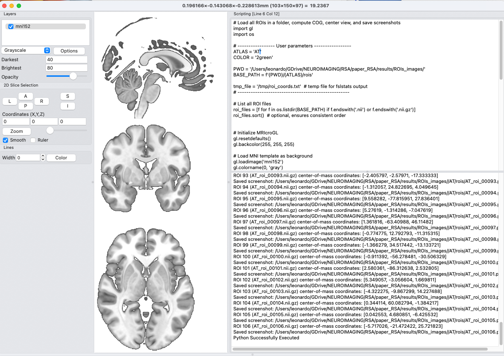

# Generate many images with python scripts inside MRIcroGL

LC October 2025 (in progress)


[MRIcroGL](https://github.com/rordenlab/MRIcroGL) is great for doing any kind of slice-based visualization of MRI volume slices (also volumes, but for surfaces, you might want to try [surf-ice](https://github.com/neurolabusc/surf-ice)).

But it's even greater because it allows you to automate the creation of images using python scripts.



Admittedly the interface is not the greatest, as most of what you would find in a common text editor is not present, however it works fine, and you can edit the python scripts in your favourite text editor before pasting them in the MRIcroGL script pane to run them.

To run a script, open with the mri command and them
CMD-N, paste the script, CMD-R (probably you have to replace CMD with Ctrl if you work in Linux or if you still insist on using windoze).

Some useful references to what is shown below:
- https://github.com/rordenlab/MRIcroGL/blob/master/PYTHON.md
- https://github.com/LeSasse/intro_to_mricrogl_scripting?tab=readme-ov-file


# Case study: Generate one image for each region in an Atlas, so that the region is clearly visible in the image

Since MRIcroGL uses python, we can combine the processing with whatever we can run in the terminal that produces an output we might use, for instance text.

In this case, my aim was to:

- extract all the regions in an atlas.nii.gz
- create the bmp of each region in MRIcroGL
- in such a way that the view was centered on the center of gravity (COG) of the ROI

The latter requirement is pretty important, since different ROIs can be in very different locations, therefore we want to adjust the field of viewpoint of the image dynamically (i.e. the specific slices chosen to take the image).

I started with a folder containing 4 atlases: AT, HO_cort, Yeo7 and Yeo17. What I show below is for Yeo7. You can use the other ones to test the procedures. You can also use your own created atlas / bunch of ROIs in a volume, as long as 

- every region in the volume is encoded as an integer number
- the nii.gz is of type FLOAT32 (for some reason fsl2ascii fails - i.e. returns a binary - if the image is of type INT8).

```
.
├── AT
│   ├── AT.nii.gz
├── HO_cort
│   ├── HO_cort.nii.gz
├── MNI152_T1_1mm_brain.nii.gz
├── README.md
├── Yeo17
│   ├── Yeo17.nii.gz
├── Yeo7
│   ├── Yeo7.nii.gz
│   ├── rois
│   └── rois_numba.txt
├── assets
│   └── mricrogl_script_interface.png
├── do_create_subregions.sh
└── mricrogl-manual.pdf
```


# Split the atlas in individual regions

This can be done directly from the terminal using fsl commands. Note how `fsl2ascii` is used to transform the nii.gz to text, so that we can then pipe it into standard bash command to have a list of the unique numbers in the volume (one for each region).

Once we get that information, we can simply run `fslmaths` to create the volumes with the single ROIs.

Note how the region number in the filenames is zeropadded.

```bash
#!/bin/bash

for atlas in Yeo7 Yeo17 HO_cort AT; do 

  root=$(pwd)/${atlas}
  dest=${root}/rois

  [ ! -d ${dest} ] && mkdir ${dest}

  fsl2ascii ${root}/${atlas} ${root}/${atlas}.txt 
  cat ${root}/${atlas}.txt* | tr ' ' '\n' | sort -n | uniq | grep -v '^0$' > ${root}/rois_numba.txt
  rm ${root}/${atlas}.txt*

  for i in $(cat ${root}/rois_numba.txt); do
    # Zero-pad number to 5 digits
    i_padded=$(printf "%05d" $i)
    echo creating ${atlas}_roi_${i_padded}
    fslmaths ${root}/${atlas} -thr ${i} -uthr ${i} ${root}/rois/${atlas}_roi_${i_padded}
  done

done
```


Example output:

```bash
Yeo7/
├── Yeo7.nii.gz
├── rois
│   ├── Yeo7_roi_00001.nii.gz
│   ├── Yeo7_roi_00002.nii.gz
│   ├── Yeo7_roi_00003.nii.gz
│   ├── Yeo7_roi_00004.nii.gz
│   ├── Yeo7_roi_00005.nii.gz
│   ├── Yeo7_roi_00006.nii.gz
│   ├── Yeo7_roi_00007.nii.gz
└── rois_numba.txt
```


# Creating the images in MRIcroGL

At this poin we have all the images we need: one for each ROI, and we can load them in MRIcroGL.

**_NB: the python interpreter inside MRIcroGL returns `\` when asked `os.getcwd()`, therefore unfortunately we need to set the equivalente of `$(pwd)` manually._**


In the repo I present the results only for the Yeo7 atlas and only for the last procedure below (3. Create all the ROIs at once). You can use the other two atlases (AT and Yeo17) to experiment, or also your own. The only important thing is that regions in the nii.gz should be encoded as integer numbers  and that the nii.gz be FLOAT32 for fsl2ascii to work.  


## 1. Load all the overlays

My first attempt was to load all of the images in MRIcroGL (hereafter, M). Note that here I still do not save the images or set the COG.

The code works, but then you find _all_ the images in the workspace, and there is apparently no way to turn them off programmatically. 


```python
import gl
import os

# Set the atlas manually here
ATLAS = 'Yeo17'

gl.resetdefaults()
gl.backcolor(255, 255, 255)

# mricro gl works in /, so we cannot use os.getcwd()
# print(os.getcwd())
PWD = '/Users/leonardo/GDrive/NEUROIMAGING/RSA/paper_RSA/results/ROIs_images/'
BASE_PATH = f'{PWD}/{ATLAS}/rois'

# Get all .nii and .nii.gz files in the directory
roi_files = [f for f in os.listdir(BASE_PATH) if f.endswith('.nii') or f.endswith('.nii.gz')]
roi_files.sort()  # optional, ensures consistent order

# Load MNI template as background
gl.loadimage('mni152')
gl.colorname(0, 'gray')
gl.opacity(0, 70)

# Load all ROI overlays
for roi in roi_files:
    roi_path = os.path.join(BASE_PATH, roi)
    gl.overlayload(roi_path)

# Apply same color and opacity to all overlays
for i in range(1, len(roi_files) + 1):
    gl.colorname(i, '2green')
    gl.opacity(i, 70)

gl.shadername('overlay')
gl.colorbarposition(0)

gl.orthoviewmm(0,0,0)
```


## 2. Loads a single ROI overlay 

- centers the view on the COG of the ROI, obtained using fslstats
- saves a bmp

Here I tried another approach: load a single ROI and then save the bmp after estimating the COG.

Since it is not possible to install additional libraries in the M's python environment, I cannot read directly from the `stdout`. So I used a trick. To estimate the COG of the ROI, I used `fslstats [ROI_number].nii.gz -c > [tmp_file]`. This fsl utility estimates the COG of the image which is fed to it. Since our ROIs images only have 1's in the ROI and zeros elsewhere, we will get the COG of the ROI. Then it's a piece of cake to read the coordinates from the tmp file.

_**NB** : Make sure that in the MRicroGL `Settings` the bmp are **not** saved with transparent background_

```python
import gl
import os

# Set the atlas and ROI number
ATLAS = 'Yeo17'
ROI_NUMBA = 2  # user-defined ROI
COLOR = '2green'

# ROI file and temporary file to store COM
roi_file = f'/Users/leonardo/GDrive/NEUROIMAGING/RSA/paper_RSA/results/ROIs_images/{ATLAS}/rois/{ATLAS}_roi_{ROI_NUMBA}.nii.gz'
tmp_file = '/tmp/roi_coords.txt'

# --------  End of user-defined parameters -------------

# Compute center-of-mass and store in tmp file
os.system(f'fslstats "{roi_file}" -c > "{tmp_file}"')

# Read coordinates from tmp file
with open(tmp_file, 'r') as f:
    coords = [float(x) for x in f.read().split()]

print(f"ROI {ROI_NUMBA} center-of-mass coordinates: {coords}")

# Initialize MRIcroGL
gl.resetdefaults()
gl.backcolor(255, 255, 255)

# Load MNI template as background
gl.loadimage('mni152')
gl.colorname(0, 'gray')
gl.opacity(0, 70)

# Load the selected ROI overlay
gl.overlayload(roi_file)
gl.colorname(1, COLOR)
gl.opacity(1, 70)

gl.shadername('overlay')
gl.colorbarposition(0)

# Center the orthogonal view on the ROI's COM
gl.orthoviewmm(*coords)


# Save screenshot in the same folder as the ROI
output_file = os.path.join(os.path.dirname(roi_file), f'{ATLAS}_roi_{ROI_NUMBA}.png')
gl.savebmp(output_file)
print(f"Screenshot saved to: {output_file}")
```


## 3. Create all ROIs bmp at once

Finally I took the interesting part from either approaches, and made a script that does the following for all ROIs at once

- load the [ROI].nii.gz
- estimate the COG using `fslstats -c`
- save the bmp 
- closes the overlay

The last step is necessary otherwise ROIs will accumulate in the viewer (see version 1.), and therefore every next ROI bmp will actually contain _all the previously loaded ROIs_, which is not what we want.


```python
# Load all ROIs in a folder, compute COG, center view, and save screenshots
import gl
import os

# ----------------- User parameters -----------------
ATLAS = 'Yeo7'
COLOR = '2green'

PWD = '/Users/leonardo/GDrive/NEUROIMAGING/RSA/paper_RSA/results/ROIs_images/'
BASE_PATH = f'{PWD}/{ATLAS}/rois'

tmp_file = '/tmp/roi_coords.txt'  # temp file for fslstats output
# ---------------------------------------------------

# List all ROI files
roi_files = [f for f in os.listdir(BASE_PATH) if f.endswith('.nii') or f.endswith('.nii.gz')]
roi_files.sort()  # optional, ensures consistent order


# Initialize MRIcroGL
gl.resetdefaults()
gl.backcolor(255, 255, 255)

# Load MNI template as background
gl.loadimage('mni152')
gl.colorname(0, 'gray')
gl.opacity(0, 70)

# Loop over all ROIs
for ROI_NUMBA, roi_name in enumerate(roi_files, start=1):
    roi_file = os.path.join(BASE_PATH, roi_name)
    
    # Compute COG with fslstats
    os.system(f'fslstats "{roi_file}" -c > "{tmp_file}"')
    
    with open(tmp_file, 'r') as f:
        coords = [float(x) for x in f.read().split()]
    
    print(f"ROI {ROI_NUMBA} ({roi_name}) center-of-mass coordinates: {coords}")
    
    # Load ROI overlay
    gl.overlayload(roi_file)
    last_index = gl.overlaycount()  # get index of the overlay just loaded
    gl.colorname(last_index, COLOR)
    gl.opacity(last_index, 70)
    gl.colorbarposition(0)
    
    # Center view on COG
    gl.orthoviewmm(*coords)
    
    # Zero-pad the ROI number to 5 digits
    ROI_NUMBA_PAD = f"{ROI_NUMBA:05d}"

    # Save BMP in the same folder as the ROI
    output_file = os.path.join(BASE_PATH, f'{ATLAS}_roi_{ROI_NUMBA_PAD}.png')
    gl.savebmp(output_file)
    print(f"Saved screenshot: {output_file}")
    
    # Close the overlay so the next screenshot is clean
    gl.overlaycloseall()


# Optional (but recommended): reset the view to 0,0,0 
gl.shadername('overlay')
gl.orthoviewmm(0,0,0)
```