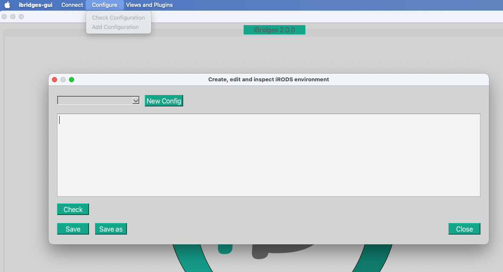
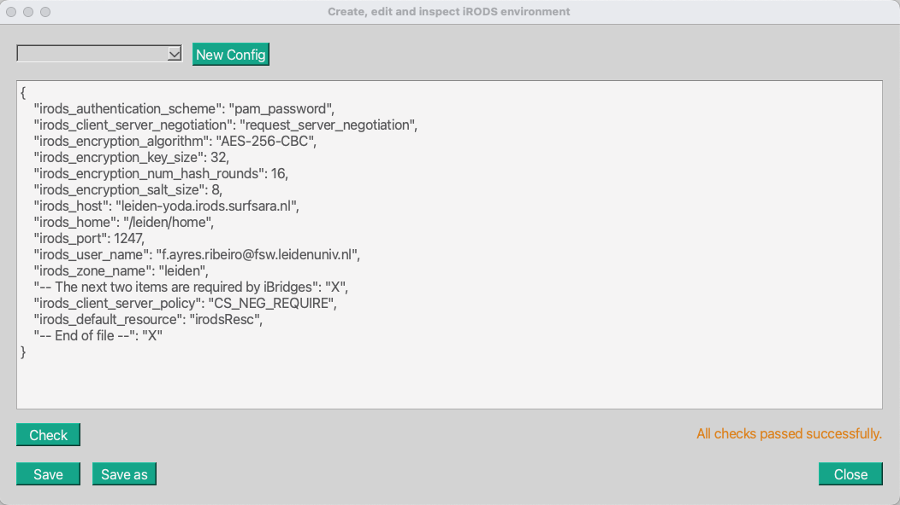
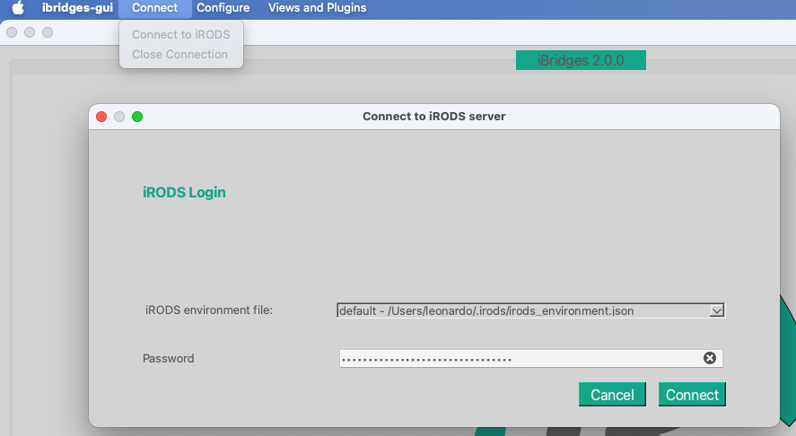
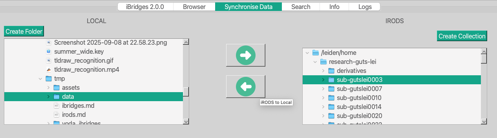

## Downloading and uploading data to Yoda with ibridges


LC Oct 2025

iBridges is a GUI-based python program to transfer data to and from a yoda server. Below I only tested the transfer from yoda to my machine.

- [Yoda documentation page on iBridges](https://servicedesk.surf.nl/wiki/spaces/WIKI/pages/74227743/iBridges+user-friendly+interface+for+data+handling)

- [video on iBridges](https://www.youtube.com/watch?v=4FdBqTDQ7jA)


## 1. Installing ibridges gui

Open a terminal and create a yoda_ibridges directory where you prefer

```bash
mkdir yoda_ibridges
cd yoda_ibridges/
```


Create a python virtual environment (venv), activate it and install `ibridgesgui`

```bash
python -m venv venv_yoda
source venv_yoda/bin/activate
# now you should see the activated vevn before prompt, like:
# (venv_yoda) ~/Desktop/tmp/yoda_ibridges
pip install ibridgesgui
```


Start ibridges gui

```
ibridges gui
```


## 2. Create a configuration

Go to `Configure -> Add Configuration`. You should see the following:




Paste your irods configuration, click the check button and wait for the confirmation that everything is in order (it takes a few seconds).

**NB: you should adapt the example configuration below with your own parameters, specifically:**

- `irods_host`
- `irods_home`
- `irods_user_name`
- `irods_zone_name`




## 3. Check the configuration files

Now open a terminal and go to your home (e.g. with the command `cd` and check these two directories and the content of the following files.

Remember that since they are hidden directories (starting with a `.`) you will not see them if you do only `ls`, instead you can do `ls -lha`.


Example of configuration files in your home directory (to ge there just type `cd` in the terminal)

```
.irods/
└── irods_environment.json

.ibridges/
└── ibridges_config.json
```


### irods_environment.json

```
{
    "irods_authentication_scheme": "pam_password",
    "irods_client_server_negotiation": "request_server_negotiation",
    "irods_encryption_algorithm": "AES-256-CBC",
    "irods_encryption_key_size": 32,
    "irods_encryption_num_hash_rounds": 16,
    "irods_encryption_salt_size": 8,
    "irods_host": "leiden-yoda.irods.surfsara.nl",
    "irods_home": "/leiden/home",
    "irods_port": 1247,
    "irods_user_name": "f.ayres.ribeiro@fsw.leidenuniv.nl",
    "irods_zone_name": "leiden",
    "-- The next two items are required by iBridges": "X",
    "irods_client_server_policy": "CS_NEG_REQUIRE",
    "irods_default_resource": "irodsResc",
    "-- End of file --": "X"
}
```


### ibridges_config.json

```bash
{
    "check_free_space": false,
    "force_transfers": true,
    "ui_tabs": [
        "tabUpDownload"
    ],
    "verbose": "info"
}
```


## 4. Connect to the server

Go back to the iBridges gui and click `Connect -> Connect to IRODS`, then enter your pw and click connect




## 5. Download data from the server to your computer

After a few seconds the interface for data transfer will come up. Go to the `Synchronize Data` tab and select the origin directory on the server (on the right) and the destination directory on your computer (on the left). Then press the bottom arrow, to transfer from the server to your computer.




Done!

