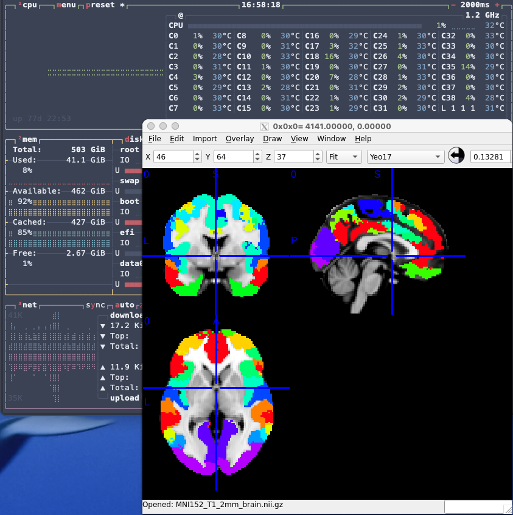

# Interaction with remote linux servers - tips for neuroimagers

LC Jan 2026




It's great to have good computing power on a remote server, however when working with neuroimaging, _once in a while_ we also need to look at the images...

x2goclient is the quickest option, but also not the ideal one: the interface is lagging, the keyboard shortcuts might differ from the ones we are used to, and in general the exchange of data is massive and not always suitable for all kinds of connections.

Fortunately, most of the functionalities offered by a remote desktop solution like x2goclient can be replaced by ssh connection, port forwarding and web interfaces in a way that satisfies the needs of someone working in neuroimaging. 

**Here I will give for granted that you know how to connect to your linux server using ssh and open a port in VS code**. If you don't, you can have a look at [this tutorial](https://github.com/leonardocerliani/SBL_terminal_tutorial/blob/main/03_storm_access/02_ssh_vs_code/02_ssh_vs_code.md). In fact, this document is more like a quick recipe list that an proper tutorial.


## Editing remote scripts

This is the easiest case: just install RemoteSSH in VS code, open the remote connection, open the remote folder and edit your scripts.


## Web services for RStudio, jupyter notebooks, Matlab, Colab

This is also relatively easy although the levels of difficulty vary. In general, the idea is always that there is a web service of the desired application (e.g. a jupyter server) running on a given remote port. By connecting to the server using VS code and opening the corresponding port in the VS code terminal, you can then interact with your application by connecting to e.g. `localhost:8888` in the web browser of your laptop.

The degree of difficulty can vary: RStudio is the easiest: if you have RStudio server running on your remote server, you just need to open the port 8787 and you are good to go. For jupyter you need to first start the jupyter server on the remote server. For Matlab, the procedure is a bit more complex and you need to create a specific python virtual environment and install some libraries, then launch jupyter lab. For Colab you need to follow [this guide](https://research.google.com/colaboratory/local-runtimes.html). 

NB: If you have a Shiny server, you just need to open the port 3838 to have your shiny apps in your local browser.


## HTML pages, e.g. fmriprep reports

Bidsapps such as fmriprep, MRIqc, Halfpipe, as well as the evergreen fsl, produce reports in the form of HTML pages. To view them locally, just run a web server on a chosen port and open the corresponding port in VS code. The following example is a bash command that uses docker and an Apache web server. 

```bash
#!/bin/bash

this_dir=[set here the location of the remote directory with index.html]

# view the content of the ${this_dir} at localhost:9999
docker run --rm  -p 9999:80 -v ${this_dir}:/usr/local/apache2/htdocs/:ro httpd
```


## Brain images

This used to be the main issue. My first guess was to just open an ssh connection with X server capabilities and run an MRI viewer from there. For instance

```bash
ssh -X leonardo@myserver.com
```

However most MRI viewers like the ones mentioned [here](https://github.com/leonardocerliani/GUTS_fmri_preproc/tree/main/TUT/00_begin_here) do not offer a smooth loading and interaction when launched over ssh. Fortunately there is still a relatively old project from the great [Chris Rorden](https://github.com/neurolabusc) that meets the need for a smooth interaction: [mricron](https://people.cas.sc.edu/rorden/mricron/install.html).

Until I will have found a good alternative in the form of a web app that can be run on the server, mricron will (egregiously) do the job.

An alternative is to this is to use the fantastic interactive R wrapper called [papayawidget](https://johnmuschelli.com/papayaWidget/) by [John Muschelli](https://johnmuschelli.com/), which allows you to include a [Papaya](https://rii-mango.github.io/Papaya/) viewer in an RMarkdown notebook. This is particularly great since you can also create web pages with (multiple) interactive visualizers for your lab notebook (or your PI report).


<br>

**If you found this useful, please consider leaving a ⭐ on github.**


