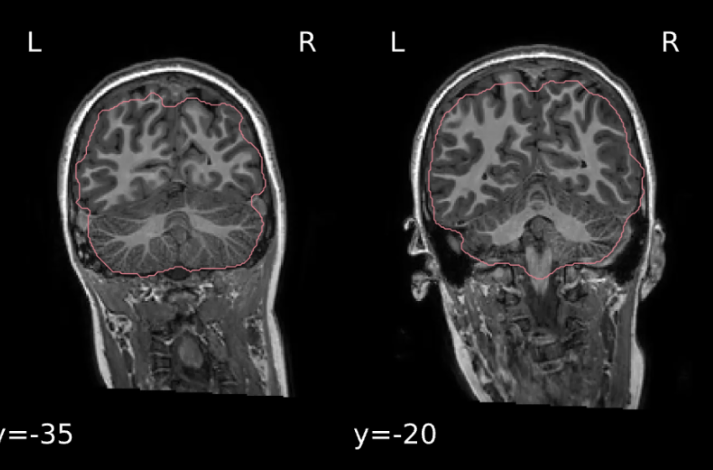
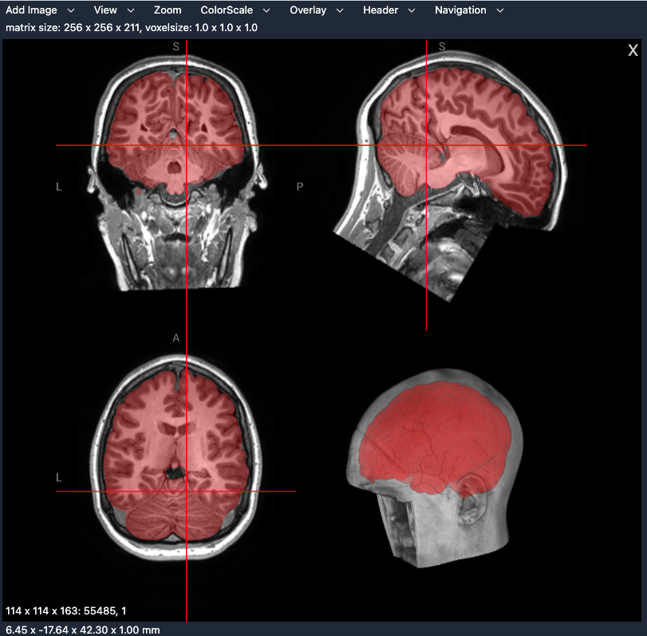

# Running fmriprep on synthstrip-prepared skull-stripped brains

_Leonardo Cerliani, Anouk van Zwieten 2026-06-02_


## The issue: fmriprep sometimes produces suboptimal skull-stripping
[fmriprep](https://fmriprep.org/en/stable/usage.html) internally uses [`ANTs`](https://github.com/antsx/ants) to carry out skull stripping + registation to MNI, and [`fsl fast`](https://fsl.fmrib.ox.ac.uk/fsl/docs/structural/fast.html) to carry out segmentation (GM, CSF, WM). 

In most cases the result is more than acceptable, however in some cases the result is largely suboptimal, with particular reference to the skull stripping. Below you can see one of these mistaken skull-stripping produced by the standard fmriprep pipeline.



When operating outside fmriprep, it is possible to use the options by the several tools provided by ANTs to fix the problematic cases. However, due to the black box nature of fmriprep, it is virtually impossible to use the same _modus operandi_ by modifying the fmriprep options.

The biggest problem of an inaccurate skull stripping is that the such errors - missed brain tissue or added non-brain tissue - negatively impact the registration. Since nowadays it is common to use elastic registration of T1w to MNI (like the one carried out in fmriprep using ANTs), this can lead to severe distortions, and therefore mislocation of brain tissues in the MNI space, sometimes difficult to notice at the visual inspection.

[Synthstrip](https://surfer.nmr.mgh.harvard.edu/docs/synthstrip/) is an alternative to other software for skull stripping (such as `bet` and `ANTs`). It is very recent and it uses DNN. It's superfast and it's bundled with freesurfer, however it can also be used in a standalone [docker container](https://hub.docker.com/r/freesurfer/synthstrip). In our experience, currently it produces the best skull-stripping we have seen so far.


## Using skull-stripped images in fmriprep
Unfortunately, it is not that easy to use synthstrip preparations in fmriprep, since:
- it is not possible to directly input a previously generated brain mask in fmriprep
- it is instead necessary use the `--skull-strip-t1w skip` in the fmriprep command _after overwriting_ the image with the `/anat/*T1w.nii.gz`- which should contain the T1w image _with_ the skull (!) - thereby overtly introducing a wrong reference of the filename with respect to the image content in the BIDS scheme.

In order to prevent the possible loss of the original image, and to allow repeating the procedure if needed using this image, one solution is to create an extra directory in the `bids/sub-XXX_ses-XX/anat` folder, e.g. with the name `ORIGINAL_T1W`. This directory will contain the original T1w image (with skull), as well as the result of synthstrip, thereby e.g. using the standard fsl convention:

- `sub-XXX_ses-01_acq-sesXX_ORIG_T1w.nii.gz`
- `sub-XXX_ses-01_acq-sesXX_ORIG_T1w_brain.nii.gz`
- `sub-XXX_ses-01_acq-sesXX_ORIG_T1w_brain_mask.nii.gz`

To have this extra directory in the `bids` folder to feed to fmriprep, the simplest solution is to add this line to the `.bidsignore` : `**/*ORIG*`.

This solution prevents the bidsvalidator to fail and stopping fmriprep, however we noticed that when the `--skull-strip-t1w skip` option is used in fmriprep, the latter still uses the images in this folder to generate a highly inaccurate mask, even though it has been specifically instructed to ignore this folder via the `.bidsignore`.

The last resort (which eventually works) is to name the files in the `ORIGINAL_T1W` with an extension that fmriprep _cannot recognize as a nifti image_, such as `.NIFTIGZ`. 

- `sub-XXX_ses-01_acq-sesXX_ORIG_T1w.NIFTIGZ`
- `sub-XXX_ses-01_acq-sesXX_ORIG_T1w_brain.NIFTIGZ`
- `sub-XXX_ses-01_acq-sesXX_ORIG_T1w_brain_mask.NIFTIGZ`

## Overview of the procedure
1. Synthstrip is used to carry out skull stripping, and both a `T1w_brain.nii.gz` and a `T1w_brain_mask.nii.gz` file are generated

2. These files are stored in a `bids/sub-XXX_ses-XX/anat/ORIGINAL_T1W` folder. Importantly, the original `T1w.nii.gz` is _also_ stored in the same folder

3. The reason to keep these files inside the `bids/sub-XXX_ses-XX/anat` folder, and not elsewhere, is twofold: first, it allows all the images to be kept in the same place (which is the natural place where the images should be), which also minimizes the risk of data loss; second, it allows the procedure to be repeated with the original non skull-stripped image, if ever needed.

4. Importantly, the script which runs synthstrip is instructed to check if there are already images in the `ORIGINAL_T1W` folder, to avoid the risk of overwriting the `T1w.nii.gz` image inside itself with the `T1w.nii.gz` inside `bids/sub-XXX_ses-XX/anat/`, which might be already a skull-stripped version produced in previous runs

5. Finally, fmriprep is called with the option `--skull-strip-t1w skip`. The script running this call will initially copy the 

`/anat/ORIGINAL_T1W/sub-XXX_ses-01_acq-sesXX_ORIG_T1w_brain.NIFTIGZ` \
onto\
`/anat/sub-XXX_ses-01_acq-sesXX_T1w.nii.gz`

6. If there is the need to repeat fmriprep with the original non skull stripped T1w, this copy will be carried out instead:

`/anat/ORIGINAL_T1W/sub-XXX_ses-01_acq-sesXX_ORIG_T1w.NIFTIGZ` \
onto\
`/anat/sub-XXX_ses-01_acq-sesXX_T1w.nii.gz`

Importantly, we recommend to run synthstrip with the `--no-csf` option
- rename the extension `.nii.gz` in the `ORIG*` folder as `.NIFTIGZ` 

# Procedure in details

## Skull-stripping with synthstrip
[Synthstrip](https://surfer.nmr.mgh.harvard.edu/docs/synthstrip/) comes with freesurfer, however it is also possible to use a dockerized version of it.

After ensuring that you have docker installed on your computer/server, and that your user is in the docker group (check `id` in the terminal), you only need to run the `synthstrip-docker.sh` command which has a very simple syntax, as shown on their website (the website is at times not reachable so I placed here an [md version of their website](./synthstrip-webpage.md))

**NB**: if your data is on windoze network drives, you need to change one detail in the script:

```bash
# Set UID and GID to avoid output files owned by root
# user = '-u %s:%s' % (os.getuid(), os.getgid())
user = ""  # instead of '-u %s:%s' % (os.getuid(), os.getgid())
```

To carry out synthstrip using `synthstrip-docker.sh` on a `bids` directory, we prepared a script which takes three inputs:

- **`bids_root`** : Path to the BIDS root directory (mandatory)
- **`n_parallel_processes`** : Number of parallel jobs (optional, default: 5)
- **`synthstrip_script`** : Path to synthstrip-docker.sh (optional,default: `$PWD/synthstrip-docker.sh`)

You can inspect this by running `run_synthstrip.sh` with no arguments.

Once it's done (a few seconds for 10 subjects on a server with 30-50 threads), you can inspect the result using your favourite image viewer or using the fantastic [niivue plugin for VS code](https://marketplace.visualstudio.com/items?itemName=KorbinianEckstein.niivue).

> [!CAUTION]
> In order to inspect the results you will manually have to rename the `.NIIGZ` extension of the images to `.nii.gz` because of the issue we discussed above about fmriprep sneaking into the supposedly .gitignored directory. Remeber to rename back the extension to `.NIFTIGZ` before running fmriprep!
> You can also temporarily comment the renaming part of the `run_synthstrip.sh` script, but *please* remember to have only `.NIFTIGZ` extension in the `ORIGINAL_T1W` folder before running fmriprep.



At the end, the filetree of the bids directory should look similar to [this](./filetree_bids.txt).


## Running fmriprep in either fast/ANTs (fmriprep default) or synthstrip mode

`run_fmriprep.sh` is a unified fMRIprep launcher that processes all subjects in `bids_root` in a single call. It supports two skull-stripping strategies, selected by setting `SKULL_STRIP_PROCEDURE` at the top of the script.

### Prerequisites

- Docker installed, and your user in the `docker` group (`id` should list `docker`)
- A Python virtual environment with `fmriprep-docker` installed (using the `requirements.txt` file - see Appendix)
- FreeSurfer license at `/usr/local/freesurfer/license.txt`
- `ORIGINAL_T1W/` folders already populated by `run_synthstrip.sh` (see section above)

### Parameters to set

Edit the parameters at the top of the `run_fmriprep.sh` according to your file location/needs:

| Parameter | Description |
|---|---|
| `SKULL_STRIP_PROCEDURE` | `"synthstrip"` or `"fmriprep"` (see table below) |
| `bids_root` | Path to the BIDS root directory |
| `deriv_root` | Path where fmriprep outputs will be written |
| `work_dir` | Scratch directory (deleted automatically after the run) |
| `nprocs` | Total parallel processes for fmriprep |
| `omp_nthreads` | OpenMP threads per process (ANTs, ITK) |
| `MNI_template` | Output space (default: `MNI152NLin2009cAsym:res-2`) |

### Skull-stripping modes

| `SKULL_STRIP_PROCEDURE` | What happens | `--skull-strip-t1w` |
|------------------------|--------------|---------------------|
| `synthstrip` | copies `ORIGINAL_T1W/*_ORIG_T1w_brain.NIFTIGZ` → `anat/*_T1w.nii.gz` | `skip` |
| `fmriprep`   | restores `ORIGINAL_T1W/*_ORIG_T1w.NIFTIGZ` → `anat/*_T1w.nii.gz` | `force` |

The script is **idempotent**: you can switch between modes at any time because the original full-head T1w is always safe in `ORIGINAL_T1W/` and is never overwritten.

### How to run

fMRIprep is a long-running job — do not run the script directly. Launch it in the background and monitor the log:

```bash
nohup ./run_fmriprep.sh >> fmriprep.log 2>&1 &
tail -f fmriprep.log
```

Or even better, use [tmux](https://github.com/tmux/tmux/wiki) (see below).

> [!TIP]
> **For large datasets** use `run_fmriprep_batches.sh` instead, which processes subjects in configurable batches and cleans the `work_dir` between each batch to manage disk space.

At the end, the filetree of the fmriprep derivatives directory should look similar to [this](./filetree_derivatives.txt).


# Appendix 

## Python virtual environments (venv)
In order not to pollute your `base` environment with loads of python packages - which might now or in the future conflict with each other - it is useful to create a local virtual environment (hereafter venv). 

This is a common practice also because by creating a snapshot of your venv once everything works, you can distribute it as a regular `requirements.txt` file e.g. in  your github, to be sure that who will use your software will run exactly with the same library/versions (at the best of a compatible python version).

```bash
# Creating a venv
python -m venv venv_fmriprep

# Installing libraries in that venv from a requirements.txt file
source venv_fmriprep/bin/activate 
pip install -r requirements.txt

# Creating a snapshot of the venv at the current state
pip freeze > requirements.txt

# Deactivate (returning to base)
deactivate
```


## Using `tmux`
fmriprep takes hours if not days to complete when many subjects are processed. In this case it is a good idea to run the fmriprep in the background or - even better - in a tmux session. This is quick getting-started for using tmux.

```bash
# Attach a new session and enter the session
tmux new -s fmriprep_session

# Detach from that session
# Ctrl-b d

# List available sessions
tmux ls

# Re-attach one specific session from tmux ls
tmux attach -t fmriprep_session
```


