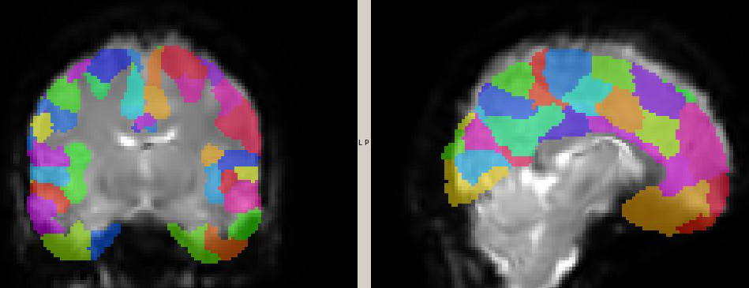

# Extracting mean signal from ROIs

When the purpose of an fmri analysis is to look at correlation between the signal in different brain regions, it can be impractical to consider the signal at each voxel - which would return a matrix of 10k^2 or more.

In these cases, it is common to use a parcellation scheme, usually from an atlas, which provides regions of interest (ROI) that can be used to average the signal over all ROI's voxels. Trading the specificity of within-ROI variability comes with the advantage of dealing with a more clean signal due to the averaging across all voxels in an ROI.



The logic is very simple: every label in the atlas is identified with an integer. Therefore extracting the mean time series for a given ROI (region of interest) reduces to:

- finding the index of the voxels with the integer corresponding to that ROI in the atlas

- averaging the signal across voxels for each ROI in the fmri data

The output will be a csv/tsv file with one column for each ROI.

> [!IMPORTANT]
> The atlas and fmri volumes must be in the same space, i.e. same voxel dimensions (e.g. 2x2x2) and image size (97x115x97). If you need to resample the atlas to match the dimension/resolution of the fmri 4D, make sure you use a nearest neighbour interpolation method that returns integer. For instance

```bash
flirt -in atlas.nii.gz \
      -ref target.nii.gz \
      -applyxfm \
      -init atlas2target.mat \
      -interp nearestneighbour \
      -out atlas_resampled.nii.gz
```

In the following there are three different implementations of the same functionality using fsl's `fslmeants`, in python and in R. They all produce a csv file or a dataframe with headers for ROI name in the atlas, and rows for the time point.

Depending on how you will use the resulting table of averaged time courses, you can decide to use the one that is most useful for you. 

The following examples use volumes and labels from Templateflow. The original disproportionately long filenames are in the `original_names.txt`. The `fmri.nii.gz` is just a toy sample with 50 volumes (to make it suitable for github).

## The minimalist: fslmeants
It has the advantage of being very concise (and fast!) and therefore easy to parallelize in bash with `xargs`. The drawback is that the final tsv file does not have labels as headers (notice that no labels.txt/tsv file is passed as input).

```bash
fslmeants -i fmri --label=atlas -o mean_ts.tsv
```

The tsv can then be converted with a csv with e.g.
```bash
awk 'BEGIN{OFS=","} {$1=$1; print}' mean_ts.tsv > mean_ts.csv
```

> [!TIP]
> Psst..! `fslmeants` gives you the option of calculating the n principal components (`--eig` option) instead of just the average time course. Therefore, when used _cum grano salis_, it can be used for a lightweight calculation of aCompCor ([Behzadi 2007](https://pmc.ncbi.nlm.nih.gov/articles/PMC2214855/), [Muschelli 2014](https://pmc.ncbi.nlm.nih.gov/articles/PMC4043948/)). This means that with a combination of Feat preprocessing + `fslmeants` + `fsl_motion_outliers` you can get in a few lines the confounds that you would get from fmriprep. (See Bonus below)
```

## The mainstream: python
The code is in `extract_mean_ts.py`. Uses numpy, pandas and nibabel (so make sure you have a `vevn` with the `requirements.txt` installed). It should be run with the following syntax:

```bash
python extract_mean_ts.py --fmri fmri  --atlas atlas --labels labels.tsv --suffix python
```

where the `fmri` and `atlas` arguments are the `nii.gz` files _without_ the extension (to avoid coding horrors in the script).

The script can be run with no arguments to show the usage. It checks that atlas and fmri file have the same dimensions. 

Since it is self-standing, it can be parallelized as a normal bash script using xargs.


## The peculiar: R
R is optimized to 2D (tabular) data, but `RNifti` is a very fast reader of nifti images, and the beauty of `dplyr` syntax with `magrittr` operators and `purrr` to avoid for loops is unparalleled. In general, R syntax is concise and very readable.

This snippet can be placed in an Rmarkdown notebook.

```R
library(RNifti)
library(tibble)
library(tidyverse)
library(readr)
library(tictoc)

extract_meants <- function(fmri_file, atlas_file, labels_file) {

  # load data
  fmri  <- readNifti(fmri_file)   # X x Y x Z x T
  atlas <- readNifti(atlas_file)  # X x Y x Z

  stopifnot(identical(dim(fmri)[1:3], dim(atlas)))

  # labels (expects columns: index, name)
  labels <- readr::read_tsv(labels_file, show_col_types = FALSE) %>%
    select(index, name)

  T <- dim(fmri)[4]

  out <- purrr::map_dfc(labels$index, function(idx) {
    mask <- atlas == idx
    if (!any(mask)) return(rep(NA_real_, T))
    colMeans(matrix(fmri[mask], ncol = T))
  })

  colnames(out) <- labels$name

  as_tibble(out)
}


ts <- extract_meants(
  fmri_file  = "fmri.nii.gz",
  atlas_file = "atlas.nii.gz",
  labels_file = "labels.tsv"
)
```

## Bonus - get the fmriprep* confounds using fsl
fmriprep is great! You give fmri data, and without knowing _anything_ about fmri data or fmri data analysis you can get a lot of stuff to fill up your disk space in just 6 hours of intense computing power! For instance the confounds you can add to your glm matrix, or use to denoise your data before running analyses like ISC.

If you understand a bit of fmri data or fmri data analysis and are mindful about burning trees, you can instead using fsl utilities. The drawback is that your scripts will be extremely simple and therefore you will not be able to impress your peers or your PI with thousands of lines of code.

A minimal pipeline is the following, assuming you already have your data preprocessed with fsl feat (which again unfortunately requires very concise scripting efforts).

```bash
# fd (before mcflirt)
fsl_motion_outliers -i fmri -m mask.nii.gz --fd -s fd.txt -o fd_4scrub.txt

# do feat preprocessing and then get the files from the .feat directory

# get the motion parameters from the feat preproc output
awk '{print $1,$2,$3,$4,$5,$6}' mc/prefiltered_func_data_mcf.par > motion6.txt

# get the first 5 principal components from the eroded WM and CSF masks
fslmeants -i fmri_preproc.nii.gz -m wm_mask_ero.nii.gz --eig --order 5 -o wm_compcor.txt
fslmeants -i fmri_preproc.nii.gz -m csf_mask_ero.nii.gz --eig --order 5 -o csf_compcor.txt

# dvars
fsl_motion_outliers -i fmri_preproc -m mask.nii.gz --dvars -s dvars.txt -o dvars_4scrub.txt

# global signal
fslmeants -i fmri_preproc.nii.gz -m brain_mask.nii.gz -o global_signal.txt

# generate zeroed fd_4scrub.txt and dvars_4scrub.txt in case there are no spikes 
n=$(wc -l < fd.txt)
[ -f fd_4scrub.txt ] || yes 0 | head -n "$n" > fd_4scrub.txt
[ -f dvars_4scrub.txt ] || yes 0 | head -n "$n" > dvars_4scrub.txt

# combine everything
paste motion6.txt \
  fd.txt fd_4scrub.txt \
  dvars.txt dvars_4scrub.txt  \
  wm_compcor.txt csf_compcor.txt global_signal.txt > confounds.txt
```

You still need to compute the derivatives of the motion parameters, but hey, that's just an `np.diff(x, axis=0)`.

\* The obtained confounds might not be _exactly_ the same you would obtain with fmriprep on the same data. Is that a problem?