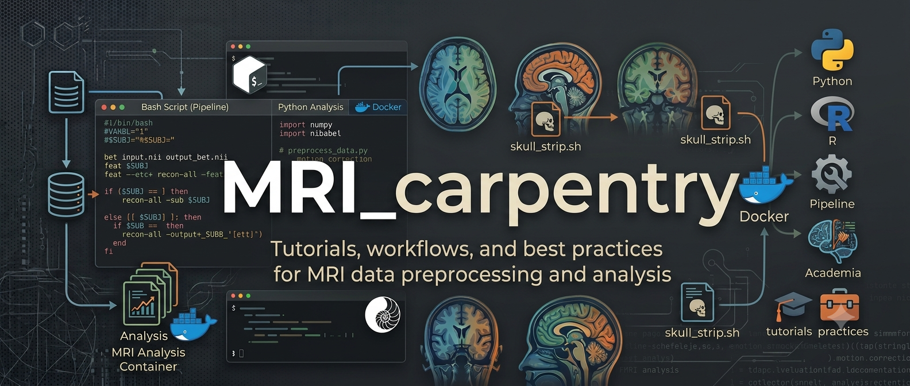

A quasi-random collection of strongly opinionated small tutorials that can help getting started with processing MRI images, mostly using [FSL](https://fsl.fmrib.ox.ac.uk/fsl/docs/#/). In the future, it might get more organized.

Other notable resources:
- [Better code, better science](https://bettercodebetterscience.github.io/book/) : forthcoming bible of MRI Analytic Engineering by [Russel Poldrack](https://profiles.stanford.edu/russell-poldrack)

- [Paperclip gxl](https://paperclip.gxl.ai/) : forthcoming standard for AI Agent-first navigation of the scientific literature

- [Our MRI preprocessing pipeline](https://github.com/leonardocerliani/MRI_hackaton) (continously updating)

## [00 begin here](gerla/00_begin_here)
- An opinionated short list of the best image viewers out there
- Link to a basic intro about working with the linux shell (which applies also to the WSL for Windows) 
- Setting up an the ole-but-efficient [fslview image viewer using Docker](https://github.com/leonardocerliani/fslview_in_a_box)
- Exploring images in RStudio using papayawidget (see also later in the folder `02_papaya_R_nifti_viewer`)
- Setting up VS code to access to a remote server (e.g. Storm) without username and pw

## [02 papaya R nifti viewer](gerla/02_papaya_R_nifti_viewer)
If you like working with R, the [`papayaWidget` by the great John Muschelli](https://johnmuschelli.com/papayaWidget/) is a life saver. Not only it enables to programmatically define views with multiple layers of overlay; by means of Rmd (R Markdown) notebooks, it allows you to create HTML pages with a full-fledged interactive 3D viewer (not just single images). This is extremely useful to share results with colleagues. You can open the `papaya_TUT.html` page for an example.

## [03 preproc FSL HalfPipe](gerla/03_preproc_FSL_HalfPipe)
A very basic tutorial about how to carry out preprocessing of fmri images (and registration to the T1w) using the FSL Feat GUI and HalfPipe

## [04 bidscoin](gerla/04_bidscoin)
Generating bids structure from PAR/REC files is (finally) a pleasant experience with [bidscoin](https://bidscoin.readthedocs.io/en/latest/). I also discuss how to handle PARs from aborted acquisitions and give a taste of how to use the generated bids structure in [BIDS apps](https://bids.neuroimaging.io//tools/bids-apps.html)

## [05 full pipeline](gerla/05_full_pipeline)
A work-in-progress collection of notes toward a full fMRI preprocessing pipeline, covering bidscoin, trimming aborted PAR acquisitions, BIDS validation, a short intro to pydeface, and running BIDS apps. A `proposal.md` sketches out an actual end-to-end pipeline design with students' needs in mind.

## [06 MRIcroGL Scripting](gerla/06_MRIcroGL_Scripting)
[MRIcroGL](https://github.com/rordenlab/MRIcroGL) is already excellent for slice-based visualization of MRI volumes, but its built-in Python scripting interface makes it even more powerful by letting you automate the creation of many images in one go. This tutorial uses atlas parcellations (Harvard-Oxford cortical atlas, Yeo 7/17 networks) as a case study for batch-generating one publication-ready image per brain region.

## [07 Yoda iBridges data transfer](gerla/07_Yoda_iBridges_data_transfer)
A quick how-to on uploading and downloading data to/from a [Yoda](https://servicedesk.surf.nl/wiki/spaces/WIKI/pages/74227743/iBridges+user-friendly+interface+for+data+handling) repository using the GUI-based Python tool [iBridges](https://www.youtube.com/watch?v=4FdBqTDQ7jA). Also includes notes on using the older iRODS icommands from inside a Docker container for situations where the GUI is not available.

## [08 pydeface](gerla/08_pydeface)
A short (still preliminary) tutorial on anonymizing T1w structural images by removing facial features using [pydeface](https://github.com/poldracklab/pydeface), a necessary step before sharing neuroimaging data publicly.

## [09 remote server 4 neuroimagers](gerla/09_remote_server_4_neuroimagers)
A practical recipe list for working with a remote Linux server from a neuroimager's perspective: editing scripts via RemoteSSH in VS Code, forwarding web services for RStudio, Jupyter, Matlab and Colab through SSH port forwarding, and viewing MRI images remotely — all without the sluggishness of a full remote desktop solution like x2go.

## [10 skullstrip synthstrip fmriprep](gerla/10_skullstrip_synthstrip_fmriprep)
`fmriprep`'s built-in ANTs skull stripping occasionally produces severely distorted results, which in turn affects the registration to MNI space. This tutorial covers a complete alternative workflow: run [SynthStrip](https://surfer.nmr.mgh.harvard.edu/docs/synthstrip/) (DNN-based, Dockerized) on the BIDS T1w images, store the originals safely in an `ORIGINAL_T1W` subfolder using a `.NIFTIGZ` extension trick to prevent fmriprep from accidentally picking them up, and then launch fmriprep in either synthstrip or default ANTs mode via a single idempotent script.

## [12 mean signal from ROIs](gerla/12_mean_signal_from_ROIs)
Instead of dealing with voxel-wise connectivity matrices of 10k² elements, a common approach is to average the fMRI signal within each atlas parcel. This tutorial shows how to extract mean ROI time series from a parcellated atlas in three different ways: using FSL's `fslmeants`, Python, and R — all producing a tidy CSV/TSV file ready for connectivity analyses.

## [13 marimo server](gerla/13_marimo-server)
A self-hosted lab server that makes interactive [marimo](https://marimo.io/) Python notebooks available to all lab members through a single browser URL — no local installation required. Each app runs in its own Docker container, the whole stack is orchestrated with `docker compose` and a Caddy reverse proxy, and all access is secured through an SSH tunnel.

## [14 Nifti Yazi](gerla/14_Nifti_Yazi)
A [Yazi](https://yazi-rs.github.io) terminal previewer plugin for NIfTI neuroimaging files (`.nii` and `.nii.gz`), using [FSL](https://fsl.fmrib.ox.ac.uk/) `slicer` utility to generate a composite image of the mid-axial/sagittal/coronal slices. Particularly useful if you work on a remote server using SSH.