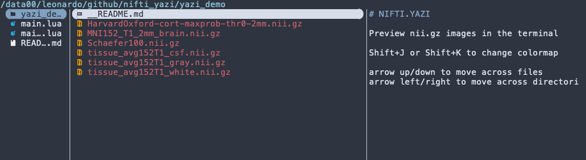

# nifti.yazi

_LC 2026-04-27_

A [Yazi](https://yazi-rs.github.io) terminal previewer plugin for NIfTI neuroimaging files (`.nii` and `.nii.gz`), using [FSL](https://fsl.fmrib.ox.ac.uk/) `slicer` utility to generate a composite image of the mid-axial/sagittal/coronal slices.

Particularly useful if you work on a remote server using SSH.

Default colormap is greyscale. `Shift-J` and `Shift-K` for other colormaps.



Exploring `.feat` directories


---

## Requirements

### FSL (FMRIB Software Library)

The plugin requires [FSL](https://fsl.fmrib.ox.ac.uk/) to be installed and the `$FSLDIR` environment variable to be set. The `slicer` binary must be available at `$FSLDIR/bin/slicer`.

To verify:
```sh
echo $FSLDIR
$FSLDIR/bin/slicer --help
```

### Yazi

Install Yazi by following the [official installation guide](https://yazi-rs.github.io/docs/installation). Yazi is available via most package managers:

```sh
# macOS
brew install yazi

# Arch Linux
pacman -S yazi

# Cargo (any platform)
cargo install --locked yazi-fm yazi-cli
```

For Debian-based (e.g. Ubuntu) visit the page with the [official binary releases](https://github.com/sxyazi/yazi/releases)


### A modern terminal with image support

Image preview requires a terminal that supports one of the following protocols:

| Protocol | Terminals |
|---|---|
| iTerm2 Inline Images | [iTerm2](https://iterm2.com/) (macOS), [WezTerm](https://wezfurlong.org/wezterm/) |
| Kitty Graphics | [Kitty](https://sw.kovidgoyal.net/kitty/), [Ghostty](https://ghostty.org/) |
| Sixel | Many terminals with Sixel support enabled |

> **Note for macOS users:** the default Terminal.app does **not** support image protocols. Use [iTerm2](https://iterm2.com/) (free) or [Ghostty](https://ghostty.org/) instead.

---

## Installation (Ubuntu)

1. Copy the files in the following structure (you might have to `mkdir ~/.config/yazi`)
```
~/.config/yazi
├── plugins
│   └── nifti.yazi
│       ├── main.lua
│       └── README.md
└── yazi.toml
```


2. Add the following to your `~/.config/yazi/yazi.toml`:

```toml
[[plugin.prepend_previewers]]
name = "*.nii.gz"
mime = "application/gzip"
run  = "nifti"

[[plugin.prepend_previewers]]
name = "*.nii"
mime = "application/octet-stream"
run  = "nifti"
```

---

## Usage

Navigate to any `.nii` or `.nii.gz` file in Yazi. The preview panel will automatically display a multi-slice mosaic of the volume (axial, coronal, and sagittal views).

### Colormap cycling

While the NIfTI preview is active, press **Shift+J** / **Shift+K** to cycle through available colormaps:

Pressing **Shift+J** steps forward; **Shift+K** steps backward. The cycle wraps around.

### Customizing colormaps

Edit the `LUTS` table at the top of `main.lua` to add, remove, or reorder colormaps. LUT files are read from `$FSLDIR/etc/luts/`. List available options with:

```sh
ls $FSLDIR/etc/luts/
```

## Similar projects

- [niicat](https://github.com/MIC-DKFZ/niicat) : python-based utility for displaying an orthographic image of the volume + info

- [headjack](https://github.com/childmindresearch/headjack) : interactive (!) nifti viewer for the terminal with several color maps

---

## License
[](https://creativecommons.org/licenses/by-nc/4.0/)

This project is licensed under Creative Commons Attribution-NonCommercial 4.0 (CC BY-NC 4.0).

Creative Commons Attribution-NonCommercial 4.0 International (CC BY-NC 4.0)

You are free to:
- Share — copy and redistribute the material
- Adapt — remix, transform, and build upon the material

Under the following terms:
- Attribution — You must give appropriate credit, provide a link to the license, and indicate if changes were made.
- NonCommercial — You may not use the material for commercial purposes.

Full license text: https://creativecommons.org/licenses/by-nc/4.0/legalcode

> [!CAUTION]
> This software is **<ins>not</ins> a medical device and is <ins>not</ins> intended for diagnostic use**. It is a developer and researcher convenience tool only. Do not use it to make clinical decisions.